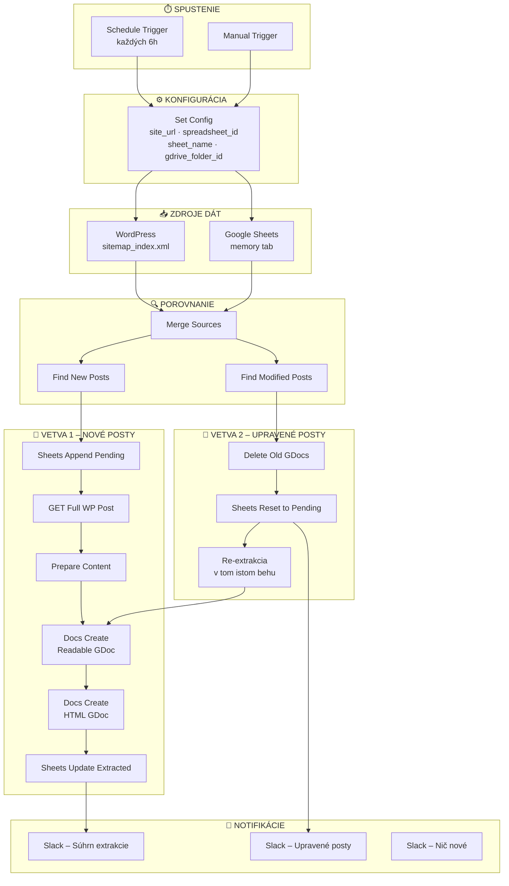
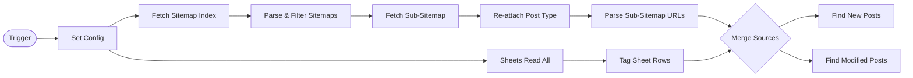
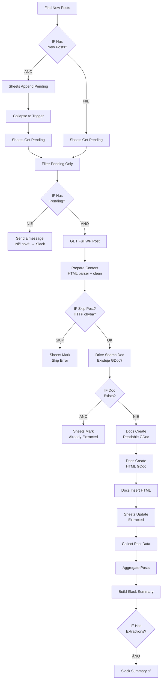
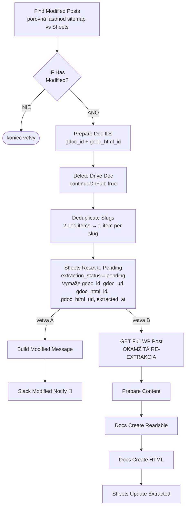
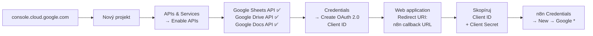
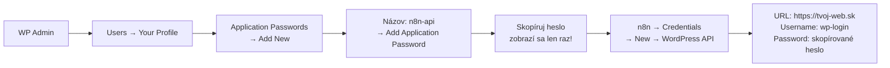
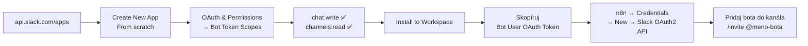
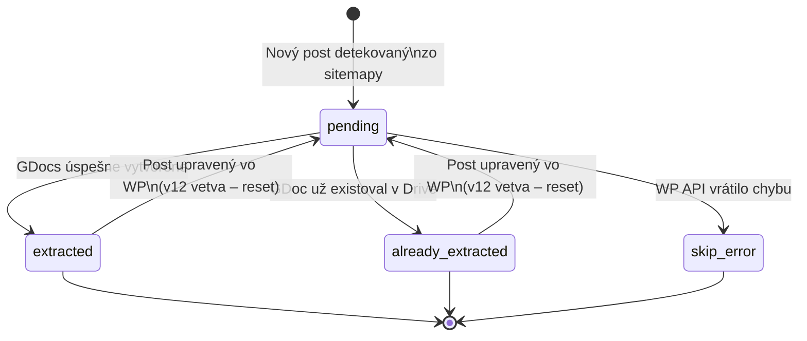

# WordPress → Google Drive Extractor
### n8n Workflow Documentation

> Automaticky sleduje WordPress posty cez sitemapy, extrahuje ich obsah a ukladá do Google Drive ako Google Docs (čitateľná verzia + čisté HTML). Detekuje nové aj upravené posty.

---

## Obsah

- [Čo workflow robí](#čo-workflow-robí)
- [Architektúra](#architektúra)
- [Hlavný flow](#hlavný-flow)
- [Vetva: Nové posty](#vetva-nové-posty)
- [Vetva: Upravené posty](#vetva-upravené-posty)
- [Inštalácia a konfigurácia](#inštalácia-a-konfigurácia)
- [Google Cloud API](#google-cloud-api)
- [WordPress API](#wordpress-api)
- [Slack](#slack)
- [Google Sheets – štruktúra](#google-sheets--štruktúra)
- [Google Drive – štruktúra súborov](#google-drive--štruktúra-súborov)
- [Stavy extrakcie](#stavy-extrakcie)
- [Troubleshooting](#troubleshooting)

---

## Čo workflow robí

```
WordPress web  →  čítaj sitemaps  →  porovnaj so Sheets  →  extrakt obsah  →  ulož do Drive  →  notifikuj Slack
```

**Konkrétne:**

| Scenár | Akcia |
|---|---|
| Nový post na webe | Pridaj do Sheets ako `pending`, vytvor 2 GDocs |
| Post bol upravený vo WP | Zmaž staré GDocs, resetuj na `pending`, re-extrakt v tom istom behu |
| Post už bol spracovaný | Označ ako `already_extracted`, preskočí |
| WP API vráti chybu | Označ ako `skip_error`, pokračuj ďalej |
| Nič nové | Pošli info správu do Slacku |

---

## Architektúra



---

## Hlavný flow



---

## Vetva: Nové posty



---

## Vetva: Upravené posty

> Beží **paralelne** s Vetvou 1 a neruší ju.



**Kľúčové:** detekcia zmeny = `sitemap lastmod` > `sheet date_modified`

---

## Inštalácia a konfigurácia

### Krok 1 – Importuj workflow

1. V n8n: **Workflows → Import from file** → nahraj `.json` súbor
2. Workflow sa otvorí v editore

### Krok 2 – Vyplň Set Config

Otvor node **Set Config** a zmeň hodnoty:

| Parameter | Popis | Príklad |
|---|---|---|
| `site_url` | URL WordPress webu, **bez** `/` na konci | `https://mojweb.sk` |
| `site_label` | Krátky label webu (zobrazuje sa v Slacku) | `mojweb.sk` |
| `spreadsheet_id` | ID Google Sheets tabuľky | `1nPZNOe7S-nFcBA0ll-...` |
| `sheet_name` | Názov záložky (listu) v tabuľke | `memory` |
| `gdrive_folder_id` | ID priečinka v Google Drive | `1p3jPAIZBJKRHNCF-...` |

**Kde nájdem Spreadsheet ID?**
```
https://docs.google.com/spreadsheets/d/ [TU JE ID] /edit
```

**Kde nájdem Drive Folder ID?**
```
https://drive.google.com/drive/folders/ [TU JE ID]
```

### Krok 3 – Priraď credentials ku všetkým nodom

Pozri sekcie nižšie pre každý typ credentials.

---

## Google Cloud API

Všetky Google integrácie (Sheets, Drive, Docs) vyžadujú Google Cloud projekt s OAuth2.

### Vytvorenie projektu a OAuth2



**Redirect URI pre n8n:**
```
https://[tvoj-n8n-host]/rest/oauth2-credential/callback
```

### Credentials v n8n

Pre každú Google službu vytvor samostatný credential:

| Credential typ | Použitie v nodom |
|---|---|
| Google Sheets OAuth2 API | Sheets Read All, Append, Update, Get, Mark... |
| Google Drive OAuth2 API | Drive Search Doc, Delete Drive Doc, Docs Create* |
| Google Docs OAuth2 API | Docs Insert HTML, Docs Insert Content |

> `Docs Create` a `Docs Create HTML` používajú **Drive API** (nie Docs API) – nahrávajú cez multipart upload.

---

## WordPress API

Workflow číta obsah postov cez WordPress REST API.

### Nastavenie Application Password



### Požiadavky na WordPress

| Požiadavka | Detail |
|---|---|
| WordPress REST API | Musí byť verejne dostupné (`/wp-json/wp/v2/`) |
| sitemap_index.xml | Generovaný pluginom (napr. Yoast, Rank Math) |
| Typy postov v sitemape | `post-sitemap.xml`, vlastné CPT sitemaps |
| Application Passwords | WordPress 5.6+ |

### Sitemaps – aké typy postov sa čítajú

Workflow hľadá v `sitemap_index.xml` tieto patterny (upraviteľné v node `Parse & Filter Sitemaps`):

```
post-sitemap.xml          →  post_type: posts
terminologia-sitemap.xml  →  post_type: terminologia
hub-destinacii-sitemap.xml →  post_type: hub-destinacii
```

Pre iné typy postov uprav node `Parse & Filter Sitemaps` – pridaj pattern do poľa `relevantPatterns`.

---

## Slack

Workflow posiela 3 typy správ:

| Správa | Kedy | Obsah |
|---|---|---|
| ✅ Súhrn extrakcie | Po úspešnom behu | Zoznam extrahovaných postov s linkami na GDocs |
| 🔄 Upravené posty | Keď sa detekuje zmena | Zoznam slugov + nový dátum zmeny |
| ℹ️ Nič nové | Keď nie sú pending posty | Jednoduchá info správa |

### Nastavenie Slack App



---

## Google Sheets – štruktúra

### Vytvorenie tabuľky

1. Vytvor novú tabuľku na [sheets.google.com](https://sheets.google.com)
2. Premenuj záložku na `memory`
3. Do riadku 1 vlož hlavičku:

```
wp_id | post_type | slug | title | status | date_published | date_modified | link | extraction_status | gdoc_id | gdoc_url | gdoc_html_id | gdoc_html_url | extracted_at | site_url
```

Copy-paste do bunky A1 (stĺpce oddelené tabulátorom):
```
wp_id	post_type	slug	title	status	date_published	date_modified	link	extraction_status	gdoc_id	gdoc_url	gdoc_html_id	gdoc_html_url	extracted_at	site_url
```

### Stĺpce a ich účel

| Stĺpec | Kedy sa vyplní | Popis |
|---|---|---|
| `wp_id` | Pri extrakcii | WordPress ID postu |
| `post_type` | Pri zápise zo sitemapy | `posts`, `terminologia`, vlastný CPT |
| `slug` | Pri zápise zo sitemapy | URL slug – **kľúčový stĺpec pre matching** |
| `title` | Pri extrakcii | Titulok postu |
| `status` | Pri zápise | Vždy `publish` |
| `date_published` | Zo sitemapy | Dátum prvého publikovania |
| `date_modified` | Zo sitemapy / pri zmene | Dátum poslednej úpravy |
| `link` | Zo sitemapy | Plná URL postu |
| `extraction_status` | Automaticky | Viď tabuľku stavov nižšie |
| `gdoc_id` | Po extrakcii | ID Readable GDoc |
| `gdoc_url` | Po extrakcii | Link na Readable GDoc |
| `gdoc_html_id` | Po extrakcii | ID HTML GDoc |
| `gdoc_html_url` | Po extrakcii | Link na HTML GDoc |
| `extracted_at` | Po extrakcii | Timestamp poslednej extrakcie |
| `site_url` | Pri zápise | Label webu z Set Config |

---

## Stavy extrakcie



| Stav | Popis |
|---|---|
| `pending` | Čaká na extrakciu |
| `extracted` | GDocs úspešne vytvorené |
| `already_extracted` | GDoc existoval v Drive (preskočený, Sheets aktualizovaný) |
| `skip_error` | WP API vrátilo 404/5xx alebo post neexistuje |

---

## Google Drive – štruktúra súborov

Pre každý WordPress post vzniknú **2 Google Docs** v jednom priečinku:

```
📁 tvoj-priečinok/
├── 📄 [123] Titulok článku               ← Readable GDoc
│       Obsah: čitateľný text + metadáta
│       Použitie: review, AI spracovanie
│
└── 📄 [123] Titulok článku – HTML        ← HTML GDoc
        Obsah: čisté HTML pre WP
        Použitie: copy-paste späť do WordPress
```

### Čo obsahuje Readable GDoc

```
[Titulok]
─────────────────────
URL:         https://...
WP ID:       123
Slug:        nazov-clanku
Typ:         posts
Publikované: 2024-01-15
Upravené:    2024-03-22
Web:         mojweb.sk
─────────────────────
[čistý obsah bez obrázkov, skriptov, shortcodes]
```

### Čo obsahuje HTML GDoc

```html
<!-- WP ID: 123 | SLUG: nazov-clanku | TYP: posts -->
<!-- TITULOK: Titulok článku -->
<!-- URL: https://... -->
<!-- PUBLIKOVANÉ: 2024-01-15 | UPRAVENÉ: 2024-03-22 -->

<h2>Sekcia</h2>
<p>Obsah...</p>
<table>...</table>
```

---

## Troubleshooting

### Sitemap sa nenačíta

```
[Parse Sitemaps] Žiadne relevantné sitemaps nenájdené
```
- Over `site_url` v Set Config (bez `/` na konci)
- Skontroluj `https://tvoj-web.sk/sitemap_index.xml` v prehliadači
- Over názvy sitemáp – musia obsahovať `post-sitemap.xml`, `terminologia-sitemap.xml` alebo `hub-destinacii-sitemap.xml`

### Drive Search Doc vracia prázdne výsledky

- Over `gdrive_folder_id` v Set Config
- Skontroluj, či má OAuth2 account prístup k priečinku
- Priečinok musí byť vlastnený alebo zdieľaný na použitý Google account

### Docs Create zlyhá s 403

- Over, že `Google Drive API` je zapnuté v Google Cloud Console
- Over, že OAuth2 consent screen má správne scopes: `drive.file` alebo `drive`

### WP API vracia 401

- Over Application Password – generuj nové v WP Admin → Users → Profile
- Over `site_url` – musí byť dostupná `/wp-json/wp/v2/`
- Skontroluj, či WP REST API nie je zakázané pluginom

### Slack nedostáva správy

- Over, že bot má scope `chat:write`
- Over Channel ID v Slack nodoch (nie názov kanála, ale ID napr. `C0AT3KG6H2B`)
- Skontroluj, že bot je pozvaný do kanála: `/invite @meno-bota`

### Post sa stále znova extrahuje

- Skontroluj `date_modified` v Sheets – ak je starší ako sitemap `lastmod`, bude resetovaný
- Skontroluj, či WP nepribúda dátum úpravy pri každom uložení (napr. pluginy)
