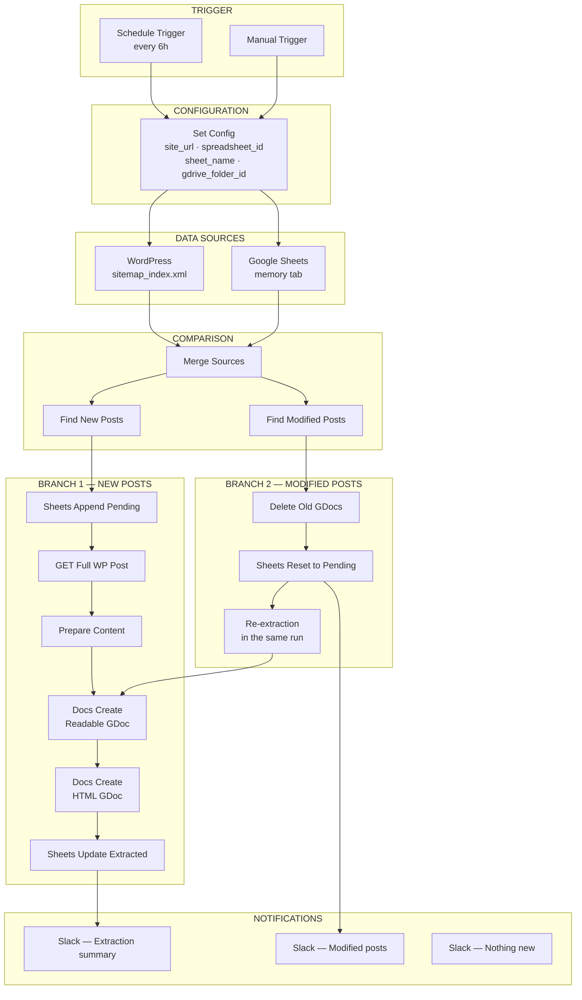
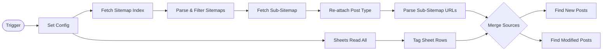
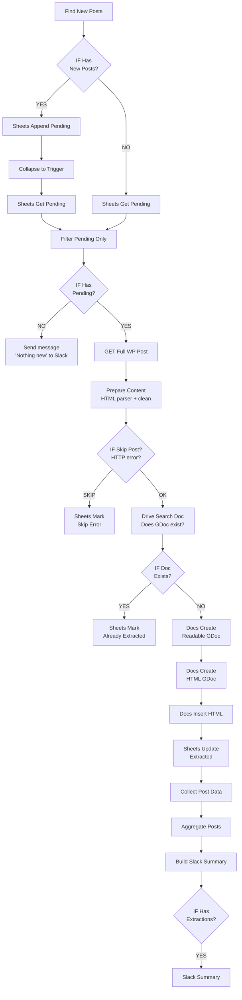
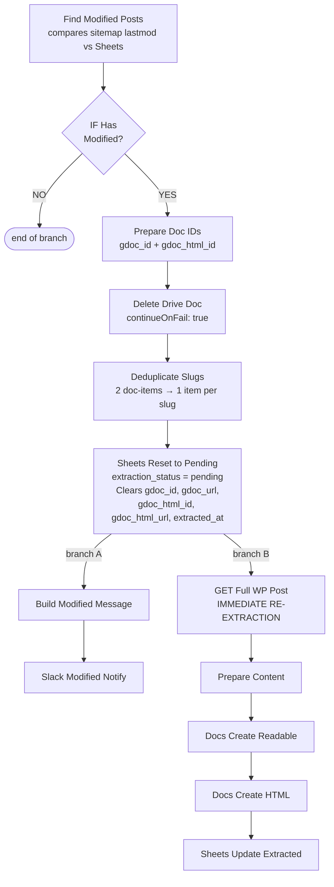
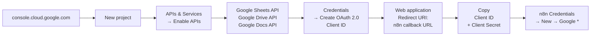
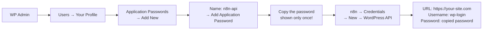
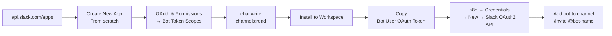
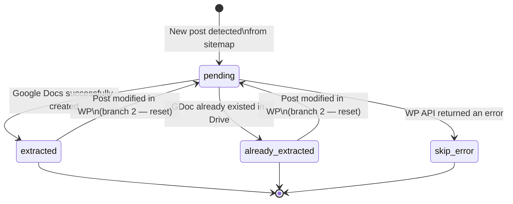

# WordPress to Google Drive Extractor
### n8n Workflow Documentation

Automatically monitors WordPress posts via XML sitemaps, extracts their content, and saves them to Google Drive as Google Docs (readable version + clean HTML). Detects both new and modified posts.

---

## Table of Contents

- [What the workflow does](#what-the-workflow-does)
- [Architecture](#architecture)
- [Main flow](#main-flow)
- [Branch: New posts](#branch-new-posts)
- [Branch: Modified posts](#branch-modified-posts)
- [Google Cloud API](#google-cloud-api)
- [WordPress API](#wordpress-api)
- [Slack](#slack)
- [Google Sheets structure](#google-sheets-structure)
- [Google Drive file structure](#google-drive-file-structure)
- [Extraction statuses](#extraction-statuses)
- [Troubleshooting](#troubleshooting)

---

## What the workflow does

```
WordPress site  →  read sitemaps  →  compare with Sheets  →  extract content  →  save to Drive  →  notify Slack
```

| Scenario | Action |
|---|---|
| New post on the site | Add to Sheets as `pending`, create 2 Google Docs |
| Post was modified in WP | Delete old Google Docs, reset to `pending`, re-extract in the same run |
| Post already processed | Mark as `already_extracted`, skip |
| WP API returns an error | Mark as `skip_error`, continue |
| Nothing new | Send an info message to Slack |

---

## Architecture



---

## Main flow



---

## Branch: New posts



---

## Branch: Modified posts

Runs **in parallel** with Branch 1 and does not interfere with it.



**Key:** change detection = `sitemap lastmod` > `sheet date_modified`

---

## Google Cloud API

All Google integrations (Sheets, Drive, Docs) require a Google Cloud project with OAuth2.

### Creating a project and OAuth2 credentials



**Redirect URI for n8n:**
```
https://[your-n8n-host]/rest/oauth2-credential/callback
```

### Credentials in n8n

Create a separate credential for each Google service:

| Credential type | Used in node |
|---|---|
| Google Sheets OAuth2 API | Sheets Read All, Append, Update, Get, Mark... |
| Google Drive OAuth2 API | Drive Search Doc, Delete Drive Doc, Docs Create* |
| Google Docs OAuth2 API | Docs Insert HTML, Docs Insert Content |

> `Docs Create` and `Docs Create HTML` use the **Drive API** (not Docs API) — they upload via multipart upload.

---

## WordPress API

The workflow reads post content via the WordPress REST API.

### Setting up an Application Password



### WordPress requirements

| Requirement | Detail |
|---|---|
| WordPress REST API | Must be publicly accessible at `/wp-json/wp/v2/` |
| sitemap_index.xml | Generated by a plugin (e.g. Yoast, Rank Math) |
| Post types in sitemaps | `post-sitemap.xml`, custom CPT sitemaps |
| Application Passwords | WordPress 5.6+ |

### Sitemaps — which post types are read

The workflow looks for these patterns in `sitemap_index.xml` (configurable in the `Parse & Filter Sitemaps` node):

```
post-sitemap.xml           →  post_type: posts
terminologia-sitemap.xml   →  post_type: terminologia
hub-destinacii-sitemap.xml →  post_type: hub-destinacii
```

For other post types, edit the `Parse & Filter Sitemaps` node and add a pattern to the `relevantPatterns` array.

---

## Slack

The workflow sends 3 types of messages:

| Message | When | Content |
|---|---|---|
| Extraction summary | After a successful run | List of extracted posts with links to Google Docs |
| Modified posts | When a change is detected | List of slugs + new modification date |
| Nothing new | When there are no pending posts | Simple info message |

### Setting up a Slack App



---

## Google Sheets structure

### Creating the spreadsheet

1. Create a new spreadsheet at [sheets.google.com](https://sheets.google.com).
2. Rename the tab to `memory`.
3. Paste the following header into row 1:

```
wp_id	post_type	slug	title	status	date_published	date_modified	link	extraction_status	gdoc_id	gdoc_url	gdoc_html_id	gdoc_html_url	extracted_at	site_url
```

### Columns and their purpose

| Column | When filled | Description |
|---|---|---|
| `wp_id` | On extraction | WordPress post ID |
| `post_type` | On sitemap write | `posts`, `terminologia`, custom CPT |
| `slug` | On sitemap write | URL slug — **key column for matching** |
| `title` | On extraction | Post title |
| `status` | On write | Always `publish` |
| `date_published` | From sitemap | Date of first publication |
| `date_modified` | From sitemap / on change | Date of last modification |
| `link` | From sitemap | Full post URL |
| `extraction_status` | Automatically | See status table below |
| `gdoc_id` | After extraction | Readable GDoc ID |
| `gdoc_url` | After extraction | Link to Readable GDoc |
| `gdoc_html_id` | After extraction | HTML GDoc ID |
| `gdoc_html_url` | After extraction | Link to HTML GDoc |
| `extracted_at` | After extraction | Timestamp of last extraction |
| `site_url` | On write | Site label from Set Config |

---

## Google Drive file structure

For each WordPress post, **2 Google Docs** are created in one folder:

```
your-folder/
├── [123] Post Title               ← Readable GDoc
│       Content: readable text + metadata
│       Use: review, AI processing
│
└── [123] Post Title - HTML        ← HTML GDoc
        Content: clean HTML for WordPress
        Use: copy-paste back into WordPress
```

### What the Readable GDoc contains

```
[Title]
─────────────────────
URL:         https://...
WP ID:       123
Slug:        post-slug
Type:        posts
Published:   2024-01-15
Modified:    2024-03-22
Site:        your-site.com
─────────────────────
[clean content without images, scripts, or shortcodes]
```

### What the HTML GDoc contains

```html
<!-- WP ID: 123 | SLUG: post-slug | TYPE: posts -->
<!-- TITLE: Post Title -->
<!-- URL: https://... -->
<!-- PUBLISHED: 2024-01-15 | MODIFIED: 2024-03-22 -->

<h2>Section</h2>
<p>Content...</p>
<table>...</table>
```

---

## Extraction statuses



| Status | Description |
|---|---|
| `pending` | Waiting for extraction |
| `extracted` | Google Docs successfully created |
| `already_extracted` | GDoc already existed in Drive (skipped, Sheets updated) |
| `skip_error` | WP API returned 404/5xx or post does not exist |

---

## Troubleshooting

### Sitemap not loading

```
[Parse Sitemaps] No relevant sitemaps found
```
- Check `site_url` in Set Config (no trailing slash).
- Open `https://your-site.com/sitemap_index.xml` in a browser.
- Check sitemap names — they must match the patterns in `Parse & Filter Sitemaps`.

### Drive Search Doc returns empty results

- Check `gdrive_folder_id` in Set Config.
- Confirm the OAuth2 account has access to the folder.
- The folder must be owned by or shared with the Google account used in Drive credentials.

### Docs Create fails with 403

- Check that **Google Drive API** is enabled in Google Cloud Console.
- Check that the OAuth2 consent screen has the correct scopes: `drive.file` or `drive`.

### WP API returns 401

- Regenerate the Application Password in WP Admin → Users → Profile.
- Check `site_url` — `/wp-json/wp/v2/` must be accessible.
- Check whether the WordPress REST API is disabled by a plugin.

### Slack not receiving messages

- Check that the bot has the `chat:write` scope.
- Use the Channel ID in Slack nodes (not the channel name, but an ID like `C0AT3KG6H2B`).
- Check that the bot is invited to the channel: `/invite @bot-name`.

### Post keeps being re-extracted

- Check `date_modified` in Sheets — if it is older than the sitemap `lastmod`, the post will be reset.
- Check whether a WordPress plugin is updating the modification date on every save.
