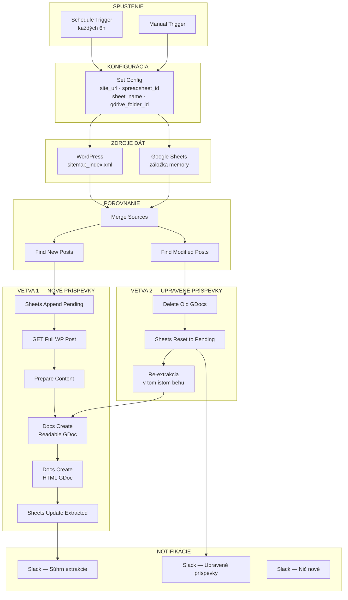
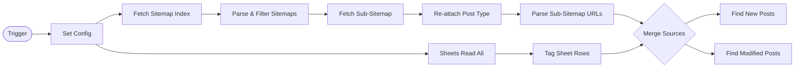
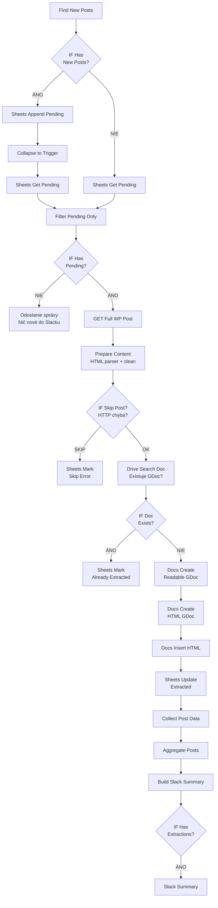
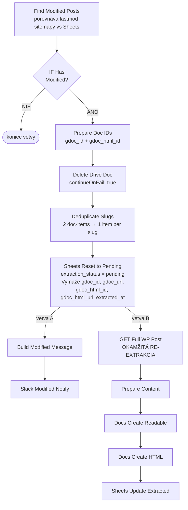
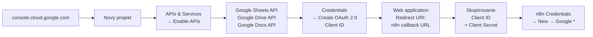
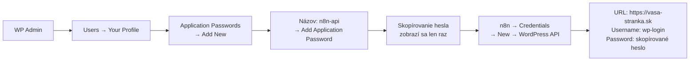
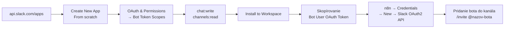
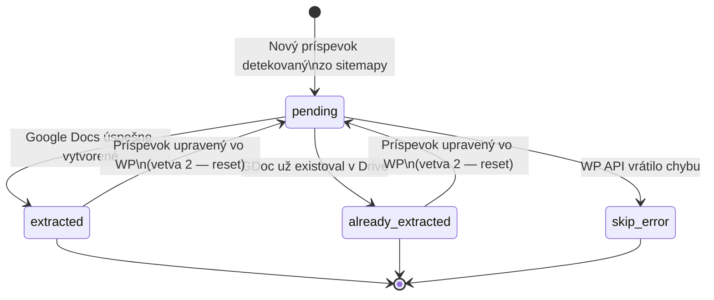

# WordPress → Google Drive Extractor
### Dokumentácia n8n workflow

Workflow automaticky sleduje WordPress príspevky cez XML sitemapy, extrahuje ich obsah a ukladá do Google Drive ako Google Docs (čitateľná verzia + čisté HTML). Detekuje nové aj upravené príspevky.

---

## Obsah

- [Čo workflow robí](#čo-workflow-robí)
- [Architektúra](#architektúra)
- [Hlavný flow](#hlavný-flow)
- [Vetva: Nové príspevky](#vetva-nové-príspevky)
- [Vetva: Upravené príspevky](#vetva-upravené-príspevky)
- [Google Cloud API](#google-cloud-api)
- [WordPress API](#wordpress-api)
- [Slack](#slack)
- [Štruktúra Google Sheets](#štruktúra-google-sheets)
- [Štruktúra súborov v Google Drive](#štruktúra-súborov-v-google-drive)
- [Stavy extrakcie](#stavy-extrakcie)
- [Riešenie problémov](#riešenie-problémov)

---

## Čo workflow robí

```
WordPress web  →  čítanie sitemáp  →  porovnanie so Sheets  →  extrakcia obsahu  →  uloženie do Drive  →  notifikácia Slack
```

| Scenár | Akcia |
|---|---|
| Nový príspevok na webe | Pridanie do Sheets ako `pending`, vytvorenie 2 Google Docs |
| Príspevok bol upravený vo WP | Zmazanie starých Google Docs, reset na `pending`, re-extrakcia v tom istom behu |
| Príspevok už bol spracovaný | Označenie ako `already_extracted`, preskočenie |
| WP API vráti chybu | Označenie ako `skip_error`, pokračovanie ďalej |
| Nič nové | Odoslanie info správy do Slacku |

---

## Architektúra



---

## Hlavný flow



---

## Vetva: Nové príspevky



---

## Vetva: Upravené príspevky

Beží **paralelne** s Vetvou 1 a neruší ju.



**Kľúčové:** detekcia zmeny = `sitemap lastmod` > `sheet date_modified`

---

## Google Cloud API

Všetky Google integrácie (Sheets, Drive, Docs) vyžadujú Google Cloud projekt s OAuth2.

### Vytvorenie projektu a OAuth2



**Redirect URI pre n8n:**
```
https://[vas-n8n-host]/rest/oauth2-credential/callback
```

### Credentials v n8n

Pre každú Google službu je potrebné vytvoriť samostatný credential:

| Typ credentialu | Použitie v node |
|---|---|
| Google Sheets OAuth2 API | Sheets Read All, Append, Update, Get, Mark... |
| Google Drive OAuth2 API | Drive Search Doc, Delete Drive Doc, Docs Create* |
| Google Docs OAuth2 API | Docs Insert HTML, Docs Insert Content |

> `Docs Create` a `Docs Create HTML` používajú **Drive API** (nie Docs API) — nahrávajú cez multipart upload.

---

## WordPress API

Workflow číta obsah príspevkov cez WordPress REST API.

### Nastavenie Application Password



### Požiadavky na WordPress

| Požiadavka | Detail |
|---|---|
| WordPress REST API | Musí byť verejne dostupné na `/wp-json/wp/v2/` |
| sitemap_index.xml | Generovaný pluginom (napr. Yoast, Rank Math) |
| Typy príspevkov v sitemape | `post-sitemap.xml`, vlastné CPT sitemaps |
| Application Passwords | WordPress 5.6+ |

### Sitemaps — aké typy príspevkov sa čítajú

Workflow hľadá v `sitemap_index.xml` tieto vzorce (upraviteľné v node `Parse & Filter Sitemaps`):

```
post-sitemap.xml           →  post_type: posts
terminologia-sitemap.xml   →  post_type: terminologia
hub-destinacii-sitemap.xml →  post_type: hub-destinacii
```

Pre iné typy príspevkov je potrebné upraviť node `Parse & Filter Sitemaps` — pridať vzorec do poľa `relevantPatterns`.

---

## Slack

Workflow posiela 3 typy správ:

| Správa | Kedy | Obsah |
|---|---|---|
| Súhrn extrakcie | Po úspešnom behu | Zoznam extrahovaných príspevkov s odkazmi na Google Docs |
| Upravené príspevky | Pri detekcii zmeny | Zoznam slugov + nový dátum zmeny |
| Nič nové | Keď nie sú pending príspevky | Jednoduchá info správa |

### Nastavenie Slack App



---

## Štruktúra Google Sheets

### Vytvorenie tabuľky

1. Vytvorte novú tabuľku na [sheets.google.com](https://sheets.google.com).
2. Premenujte záložku na `memory`.
3. Vložte nasledujúcu hlavičku do riadku 1:

```
wp_id	post_type	slug	title	status	date_published	date_modified	link	extraction_status	gdoc_id	gdoc_url	gdoc_html_id	gdoc_html_url	extracted_at	site_url
```

### Stĺpce a ich účel

| Stĺpec | Kedy sa vyplní | Popis |
|---|---|---|
| `wp_id` | Pri extrakcii | WordPress ID príspevku |
| `post_type` | Pri zápise zo sitemapy | `posts`, `terminologia`, vlastný CPT |
| `slug` | Pri zápise zo sitemapy | URL slug — **kľúčový stĺpec pre matching** |
| `title` | Pri extrakcii | Titulok príspevku |
| `status` | Pri zápise | Vždy `publish` |
| `date_published` | Zo sitemapy | Dátum prvého publikovania |
| `date_modified` | Zo sitemapy / pri zmene | Dátum poslednej úpravy |
| `link` | Zo sitemapy | Plná URL príspevku |
| `extraction_status` | Automaticky | Pozri tabuľku stavov nižšie |
| `gdoc_id` | Po extrakcii | ID Readable GDoc |
| `gdoc_url` | Po extrakcii | Odkaz na Readable GDoc |
| `gdoc_html_id` | Po extrakcii | ID HTML GDoc |
| `gdoc_html_url` | Po extrakcii | Odkaz na HTML GDoc |
| `extracted_at` | Po extrakcii | Timestamp poslednej extrakcie |
| `site_url` | Pri zápise | Label webu z Set Config |

---

## Štruktúra súborov v Google Drive

Pre každý WordPress príspevok vzniknú **2 Google Docs** v jednom priečinku:

```
vas-priecinok/
├── [123] Titulok článku               ← Readable GDoc
│       Obsah: čitateľný text + metadáta
│       Použitie: review, AI spracovanie
│
└── [123] Titulok článku – HTML        ← HTML GDoc
        Obsah: čisté HTML pre WordPress
        Použitie: copy-paste späť do WordPress
```

### Čo obsahuje Readable GDoc

```
[Titulok]
─────────────────────
URL:         https://...
WP ID:       123
Slug:        nazov-clanku
Typ:         posts
Publikované: 2024-01-15
Upravené:    2024-03-22
Web:         vasa-stranka.sk
─────────────────────
[čistý obsah bez obrázkov, skriptov, shortcodes]
```

### Čo obsahuje HTML GDoc

```html
<!-- WP ID: 123 | SLUG: nazov-clanku | TYP: posts -->
<!-- TITULOK: Titulok článku -->
<!-- URL: https://... -->
<!-- PUBLIKOVANÉ: 2024-01-15 | UPRAVENÉ: 2024-03-22 -->

<h2>Sekcia</h2>
<p>Obsah...</p>
<table>...</table>
```

---

## Stavy extrakcie



| Stav | Popis |
|---|---|
| `pending` | Čaká na extrakciu |
| `extracted` | Google Docs úspešne vytvorené |
| `already_extracted` | GDoc existoval v Drive (preskočený, Sheets aktualizovaný) |
| `skip_error` | WP API vrátilo 404/5xx alebo príspevok neexistuje |

---

## Riešenie problémov

**Sitemap sa nenačíta**
- Overte `site_url` v Set Config — nesmie obsahovať lomku na konci.
- Skontrolujte `https://vasa-stranka.sk/sitemap_index.xml` v prehliadači.
- Overte názvy sitemáp — musia zodpovedať vzorcom v node `Parse & Filter Sitemaps`.

**Drive Search Doc vracia prázdne výsledky**
- Overte `gdrive_folder_id` v Set Config.
- Skontrolujte, či má OAuth2 účet prístup k priečinku.
- Priečinok musí byť vlastnený alebo zdieľaný na použitý Google účet.

**Docs Create zlyhá s chybou 403**
- Overte, že `Google Drive API` je zapnuté v Google Cloud Console.
- Overte, že OAuth2 consent screen má správne scopes: `drive.file` alebo `drive`.

**WP API vracia 401**
- Vygenerujte nové Application Password v WP Admin → Users → Profile.
- Overte `site_url` — `/wp-json/wp/v2/` musí byť dostupné.
- Skontrolujte, či REST API nie je zakázané pluginom.

**Slack nedostáva správy**
- Overte, že bot má scope `chat:write`.
- Použite Channel ID v Slack nodoch (napr. `C0AT3KG6H2B`), nie názov kanála.
- Skontrolujte, že bot je pozvaný do kanála: `/invite @nazov-bota`.

**Príspevok sa stále znova extrahuje**
- Skontrolujte `date_modified` v Sheets — ak je starší ako `lastmod` zo sitemapy, bude resetovaný.
- Skontrolujte, či WordPress plugin nepribúda dátum úpravy pri každom uložení.
