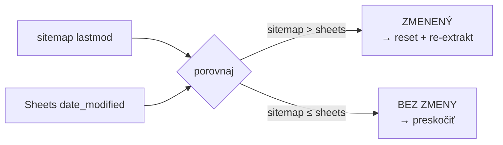

# 🔄 WordPress → Google Drive Extractor

> **n8n workflow** – Automaticky sleduje WordPress posty cez XML sitemaps, extrahuje obsah a ukladá do Google Drive ako Google Docs. Detekuje nové aj upravené posty. Notifikuje cez Slack.

---

## Stack


| Služba | Účel |
|---|---|
| **n8n** | Orchestrácia celého workflow |
| **WordPress REST API** | Čítanie obsahu postov |
| **XML Sitemaps** | Zdrojový zoznam URL, detekcia zmien cez `lastmod` |
| **Google Sheets** | Pamäť – sleduje stav každého postu |
| **Google Drive** | Úložisko Google Docs súborov |
| **Google Docs** | Výstupný formát – Readable + HTML verzia |
| **Google Cloud API** | OAuth2 autentifikácia pre všetky Google služby |
| **Slack** | Notifikácie po každom behu |

---

## Čo workflow robí

```
WordPress sitemap  →  porovnaj s pamäťou (Sheets)  →  extrakt obsah  →  ulož ako GDocs  →  notifikuj Slack
```

**Dve paralelné vetvy:**

- 📝 **Vetva 1 – Nové posty:** Nájde posty v sitemape, ktoré ešte nie sú v Sheets → vytvorí 2 GDocs (čitateľná verzia + čisté HTML)
- 🔄 **Vetva 2 – Upravené posty:** Detekuje zmeny cez `lastmod` → zmaže staré GDocs → re-extrahuje **v tom istom behu**

---

## Súbory

| Súbor | Popis |
|---|---|
| `workflow.json` | n8n workflow – importuj priamo do n8n |
| `DOCUMENTATION.md` | Podrobná dokumentácia s diagrammi a návodmi |

---

## Quickstart

### 1. Požiadavky

- **n8n** v1.0+ (self-hosted alebo cloud)
- **WordPress** 5.6+ s aktívnym REST API a XML sitemapami
- **Google Cloud** projekt s OAuth2 credentials
- **Slack** workspace s Bot tokenem

### 2. Import workflow

```bash
# V n8n UI:
# Workflows → Import from file → vyber workflow.json
```

### 3. Vytvor Google Sheets tabuľku

Vytvor novú tabuľku, premenuj záložku na `memory` a vlož hlavičku do riadku 1:

```
wp_id	post_type	slug	title	status	date_published	date_modified	link	extraction_status	gdoc_id	gdoc_url	gdoc_html_id	gdoc_html_url	extracted_at	site_url
```

### 4. Vytvor Google Drive priečinok

1. Choď na [drive.google.com](https://drive.google.com) → **+ Nový → Priečinok**
2. Otvor priečinok, skopíruj ID z URL:
   ```
   https://drive.google.com/drive/folders/ [TU JE FOLDER ID]
   ```

### 5. Vyplň Set Config

| Parameter | Hodnota |
|---|---|
| `site_url` | `https://tvoj-web.sk` (bez `/` na konci) |
| `site_label` | `tvoj-web.sk` |
| `spreadsheet_id` | ID z URL Google Sheets |
| `sheet_name` | `memory` |
| `gdrive_folder_id` | ID z URL Google Drive priečinka |

### 6. Nastav credentials

#### WordPress API
```
WP Admin → Users → Profile → Application Passwords → Add New
```
V n8n: **Credentials → New → WordPress API**

#### Google (Sheets + Drive + Docs)
```
console.cloud.google.com → APIs & Services → Enable:
  ✅ Google Sheets API
  ✅ Google Drive API
  ✅ Google Docs API

→ Credentials → Create OAuth 2.0 Client ID
→ Redirect URI: https://[n8n-host]/rest/oauth2-credential/callback
```
V n8n: vytvor 3 separate credentials (Sheets OAuth2, Drive OAuth2, Docs OAuth2)

#### Slack
```
api.slack.com/apps → Create App → OAuth & Permissions
  Scopes: chat:write, channels:read
→ Install to Workspace → skopíruj Bot User OAuth Token
→ /invite @tvoj-bot do kanála
```

### 7. Priraď credentials ku nodom

Otvor každý node a priraď správny credential. Kompletný zoznam nájdeš v [DOCUMENTATION.md](DOCUMENTATION.md).

### 8. Spusti manuálne

Klikni **▶ Execute workflow** a skontroluj výsledky v n8n editore.

---

## Ako funguje detekcia zmien



Workflow porovnáva dátum `lastmod` z XML sitemapy s hodnotou `date_modified` v Google Sheets. Ak je sitemap dátum novší → post bol upravený vo WordPress.

---

## Výstupné súbory v Google Drive

Pre každý post vzniknú **2 Google Docs:**

```
📁 tvoj-priečinok/
├── 📄 [wp_id] Titulok článku          ← čitateľná verzia + metadáta
└── 📄 [wp_id] Titulok článku – HTML   ← čisté HTML pre copy-paste do WP
```

---

## Stavy postov v Sheets

| Stav | Popis |
|---|---|
| `pending` | Čaká na extrakciu |
| `extracted` | GDocs úspešne vytvorené |
| `already_extracted` | GDoc existoval v Drive, Sheets aktualizovaný |
| `skip_error` | WP API vrátilo chybu (404, 5xx) |

---

## Slack notifikácie

| Správa | Kedy |
|---|---|
| ✅ Súhrn s linkami na GDocs | Po úspešnej extrakcii |
| 🔄 Zoznam upravených postov | Keď sa detekuje zmena `lastmod` |
| ℹ️ Nič nové | Keď nie sú žiadne pending posty |

---

## Konfigurácia sitemáp

Workflow čítа tieto sitemaps (upraviteľné v node `Parse & Filter Sitemaps`):

```javascript
const relevantPatterns = [
  'post-sitemap.xml',          // štandardné WP posty
  'terminologia-sitemap.xml',  // vlastný CPT
  'hub-destinacii-sitemap.xml' // vlastný CPT
];
```

Pre iné typy postov pridaj vlastný pattern.

---

## Podrobná dokumentácia

Kompletný návod vrátane diagramov, troubleshootingu a step-by-step nastavenia každého API nájdeš v súbore:

📄 **[DOCUMENTATION.md](DOCUMENTATION.md)**

---

## Licencia

MIT
